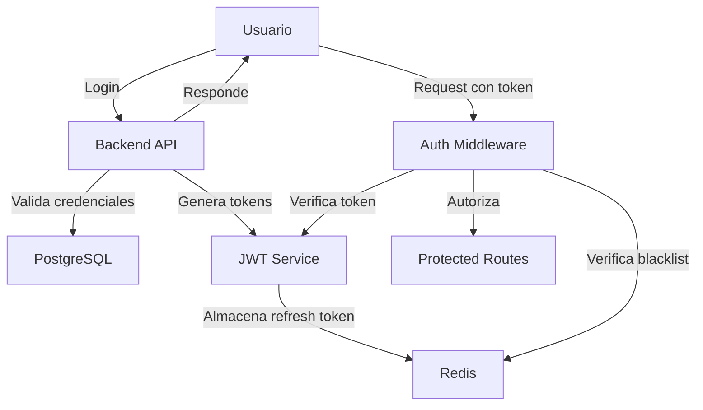

# 🔒 Plan de Seguridad - SIGEP

**Sistema de Gestión Estadística Policial**

---

## 📋 Resumen Ejecutivo

Este documento establece las políticas, procedimientos y medidas de seguridad implementadas en el Sistema de Gestión Estadística Policial (SIGEP) para proteger la integridad, confidencialidad y disponibilidad de los datos.

---

## 1. 🛡️ Arquitectura de Seguridad

### 1.1 Componentes del Sistema

| Componente | Tecnología | Función de Seguridad |
|------------|------------|----------------------|
| **Frontend** | React + TypeScript | Validación de entrada, rutas protegidas |
| **Backend** | Node.js + Express | Autenticación, autorización, validación |
| **Base de Datos** | PostgreSQL | Almacenamiento seguro, integridad referencial |
| **Caché** | Redis | Gestión de tokens, blacklisting |

### 1.2 Flujo de Seguridad



---

## 2. 🔐 Autenticación

### 2.1 Sistema de Tokens JWT

El sistema implementa autenticación basada en **JWT (JSON Web Tokens)** con par de tokens:

| Token | Propósito | Duración |
|-------|-----------|----------|
| **Access Token** | Autenticación de requests | 1 hora |
| **Refresh Token** | Renovación de sesión | 7 días |

### 2.2 Gestión de Contraseñas

- **Algoritmo**: bcrypt con factor de costo 12
- **Almacenamiento**: Solo hash (nunca texto plano)
- **Validación**: Comparación segura con timing constante

```
Password → bcrypt.genSalt(12) → bcrypt.hash() → PasswordHash
```

### 2.3 Proceso de Login

1. Usuario envía credenciales (username + password)
2. Sistema busca usuario en base de datos
3. Verifica hash de contraseña con bcrypt
4. Genera par de tokens (access + refresh)
5. Almacena refresh token en Redis
6. Retorna tokens y datos de usuario

### 2.4 Invalidación de Sesiones

- **Logout**: Token de acceso agregado a blacklist en Redis
- **Refresh Token**: Eliminado de Redis al cerrar sesión
- **Tokens Expirados**: Rechazados automáticamente por verificación JWT

---

## 3. 👥 Autorización y Control de Acceso

### 3.1 Roles del Sistema

| Rol | Descripción | Nivel de Acceso |
|-----|-------------|-----------------|
| **ADMIN** | Administrador | Control total del departamento asignado |
| **EDITOR** | Editor de datos | Lectura y escritura de datos |
| **VIEWER** | Solo lectura | Visualización de información |

### 3.2 Sistema de Permisos

Los permisos se asignan por usuario y controlan el acceso a módulos específicos:

| Permiso | Descripción |
|---------|-------------|
| `all` | Acceso total (superadministrador) |
| `read` | Lectura de datos |
| `write` | Escritura de datos |
| `export` | Exportación de informes |
| `admin` | Funciones administrativas |
| `d1`, `d2`, ... | Acceso a departamento específico |

### 3.3 Middleware de Seguridad

```
authMiddleware → requireRole → requirePermission → Recurso Protegido
```

- **authMiddleware**: Verifica token JWT válido y no en blacklist
- **requireRole**: Verifica rol mínimo requerido
- **requirePermission**: Verifica permisos específicos del módulo

---

## 4. 🏢 Departamentos y Módulos

### 4.1 Estructura Organizacional

| Código | Departamento | Color Identificador |
|--------|--------------|---------------------|
| `d1` | Personal | 🔵 #1e3a5f |
| `d2` | Inteligencia Criminal | 🔷 #0ea5e9 |
| `d3` | Operaciones Policiales | 🔴 #ef4444 |
| `d4` | Logística | 🟠 #f59e0b |
| `d5` | Judicial | 🟣 #8b5cf6 |
| `asuntos_internos` | Asuntos Internos | ⚫ #374151 |
| `delitos_rurales` | Delitos Rurales | 🟢 #22c55e |
| `digedrop` | Drogas Peligrosas | 🔴 #dc2626 |
| `prevencion_ciudadana` | Prevención Ciudadana | 🔵 #06b6d4 |
| `unidades_especiales` | Unidades Especiales | 🟠 #ea580c |
| `institutos` | Institutos e Instrucción | 🔵 #2563eb |
| `unidades_regionales` | Unidades Regionales | 🟣 #7c3aed |

### 4.2 Aislamiento de Datos

- Cada usuario tiene acceso **solo a su departamento asignado**
- El superadministrador tiene acceso a **todos los módulos**
- Los permisos se verifican en cada request al backend

---

## 5. 📝 Auditoría y Trazabilidad

### 5.1 Registro de Cambios (Historial)

Todos los cambios en datos críticos se registran:

| Campo | Descripción |
|-------|-------------|
| `timestamp` | Fecha y hora del cambio |
| `usuarioId` | Identificador del usuario |
| `tablaConfigId` | Tabla modificada |
| `filaId` | Fila específica |
| `campo` | Campo modificado |
| `valorAnterior` | Valor antes del cambio |
| `valorNuevo` | Valor después del cambio |

### 5.2 Snapshots Mensuales

- **Propósito**: Respaldo mensual del estado de datos
- **Contenido**: JSON con todos los datos del sistema
- **Trazabilidad**: Registro del usuario que creó el snapshot

---

## 6. 🚨 Políticas de Seguridad

### 6.1 Gestión de Contraseñas

> [!IMPORTANT]
> **Requisitos de Contraseña**
> - Mínimo 8 caracteres recomendado
> - Cambio periódico cada 90 días (recomendado)
> - No reutilizar contraseñas anteriores

### 6.2 Gestión de Sesiones

> [!WARNING]
> **Seguridad de Sesión**
> - Cerrar sesión al terminar de usar el sistema
> - No compartir tokens de acceso
> - Tokens expiran automáticamente después de 1 hora de inactividad

### 6.3 Protección de Datos

- ✅ Todos los datos sensibles se transmiten cifrados (HTTPS recomendado en producción)
- ✅ Contraseñas hasheadas con bcrypt (factor 12)
- ✅ Tokens JWT firmados con secretos seguros
- ✅ Redis para gestión segura de sesiones

---

## 7. 🔧 Configuración de Seguridad

### 7.1 Variables de Entorno Críticas

| Variable | Descripción | Importancia |
|----------|-------------|-------------|
| `JWT_SECRET` | Secreto para tokens de acceso | 🔴 Crítico |
| `JWT_REFRESH_SECRET` | Secreto para refresh tokens | 🔴 Crítico |
| `DATABASE_URL` | Conexión a PostgreSQL | 🔴 Crítico |
| `REDIS_URL` | Conexión a Redis | 🟠 Importante |

> [!CAUTION]
> **Nunca exponer las variables de entorno en repositorios públicos ni en logs.**

### 7.2 CORS (Cross-Origin Resource Sharing)

- Origen permitido configurado en `CORS_ORIGIN`
- Protección contra ataques CSRF

---

## 8. 📊 Recomendaciones de Seguridad

### 8.1 Producción

- [ ] Usar HTTPS obligatorio
- [ ] Configurar secretos JWT fuertes (mínimo 32 caracteres)
- [ ] Habilitar firewall para puertos no necesarios
- [ ] Configurar backups automáticos de PostgreSQL
- [ ] Monitorear logs de acceso

### 8.2 Mantenimiento

- [ ] Actualizar dependencias regularmente
- [ ] Revisar vulnerabilidades con `npm audit`
- [ ] Rotar secretos JWT periódicamente
- [ ] Auditar permisos de usuarios inactivos

### 8.3 Respuesta a Incidentes

1. **Detección**: Monitorear logs de autenticación fallida
2. **Contención**: Desactivar usuario comprometido (`activo: false`)
3. **Recuperación**: Regenerar tokens, cambiar contraseñas
4. **Análisis**: Revisar historial de cambios

---

## 9. 📞 Contactos de Seguridad

| Rol | Responsabilidad |
|-----|-----------------|
| **Superadministrador** | Gestión de usuarios y configuración global |
| **Administrador de Departamento** | Gestión de usuarios del departamento |

---

*Documento generado el 30 de Diciembre de 2024*
*Versión 1.0*
